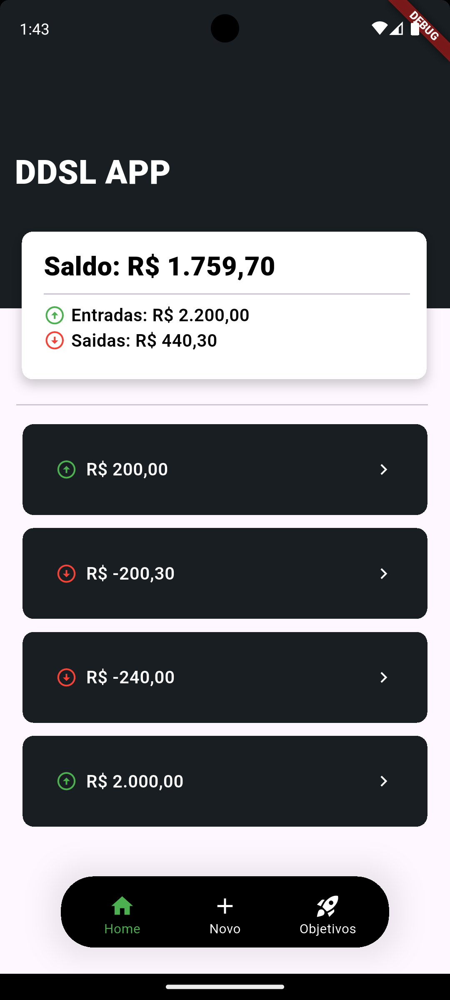
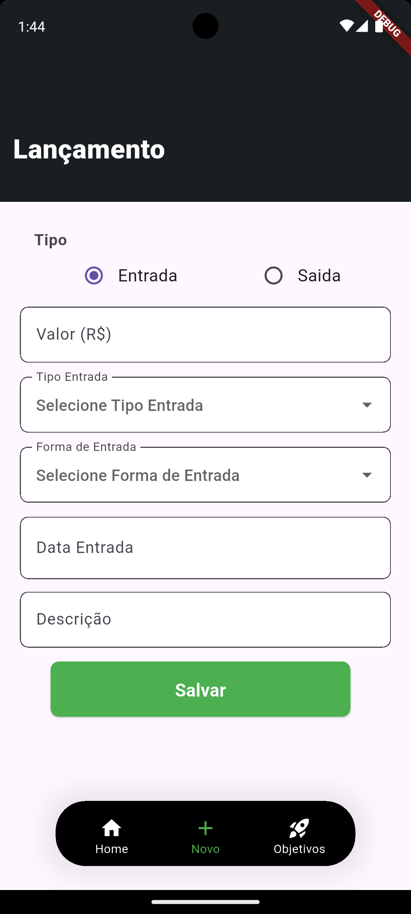
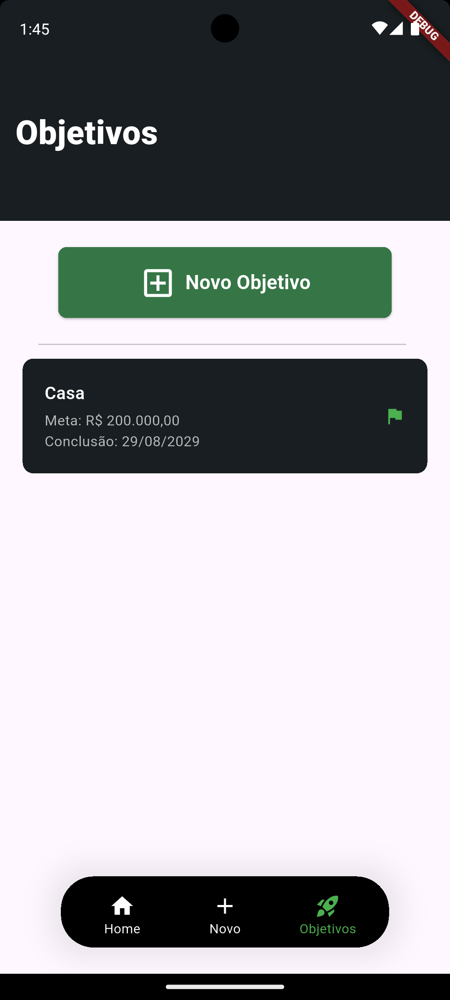

# DDSL App - Projeto Final Desenvolvimento Híbrido - PUCPR

## Descrição do Projeto

Este projeto trata-se de um aplicativo para controle financeiro em desenvolvido em Flutter, que permite ao usuario realizar movimentações de entrada e saída, acompanhar o saldo em tempo real e criar objetivos financeiros, associando aportes e retiradas a cada objetivo até atingir o valor desejado. Todos os dados são persistidos localmente no dispositivo para simplificar o projeto.

---

## Contexto

Este é meu primeiro projeto utilizando Flutter

---
## Informações

* **Desenvolvedor:** Gustavo Alfredo
* **Universidade:** PUCPR
* **Pós-Graduação:** Desenvolvimento de Aplicativos Moveis
* **Curso:** Desenvolvimento Híbrido
* **Data:** 29/08/2026

---

## Tecnologias

* Linguagem principal: Dart
* Framework: Flutter (SDK ^3.12.2)
* Persistência local: shared_preferences

---

## Vídeo Explicativo e Front-End

📼 [Video Explicativo](https://youtu.be/SEOZByyi9yY)

---

## Como Executar o Projeto

### Pré-requisitos

* **Flutter SDK** (compatível com Dart ^3.12.2) — [Download](https://docs.flutter.dev/get-started/install)
* **Git** — [Download](https://git-scm.com/)
* **IDE**: **Android Studio** ou **VS Code** com extensão Flutter
* Emulador Android/iOS configurado ou dispositivo físico conectado

---

### Passos para Instalação e execução

1. Clone o repositório:

```bash
git clone 
```

2. Acesse a pasta do projeto:

```bash
cd ddsl_app
```

3. Instale as dependências:

```bash
flutter pub get
```

---

### Iniciar Projeto

1. Via terminal:

```bash
flutter run
```

2. Via IDE (Android Studio / VS Code):

* Abra o projeto: `File → Open → selecione a pasta raiz`
* Aguarde a IDE indexar e baixar as dependências
* Localize o arquivo `lib/main.dart`
* Clique no ícone ▶ ao lado da função `main` e selecione **Run**

---

### Funcionalidades e Telas

---
### Início (Home)

| Tela             | Descrição                                                             |
|------------------|------------------------------------------------------------------------|
| `HomeScreen`     | Exibe o saldo atual e o histórico de movimentações (entradas/saídas)  |
| `DetailMovementScreen` | Exibe detalhes de uma movimentação e permite sua exclusão       |



---
### Lançamento de Movimentações

| Tela                  | Descrição                                            |
|-----------------------|-------------------------------------------------------|
| `NewMovementScreen`   | Cadastro de uma nova movimentação financeira          |



---
### Objetivos

| Tela                    | Descrição                                                          |
|-------------------------|----------------------------------------------------------------------|
| `ObjectiveScreen`       | Lista os objetivos financeiros cadastrados                          |
| `NewObjectiveScreen`    | Cadastro de um novo objetivo (nome, valor alvo, data de conclusão)  |
| `DetailObjectiveScreen` | Exibe o progresso do objetivo e permite registrar/remover aportes   |



---
